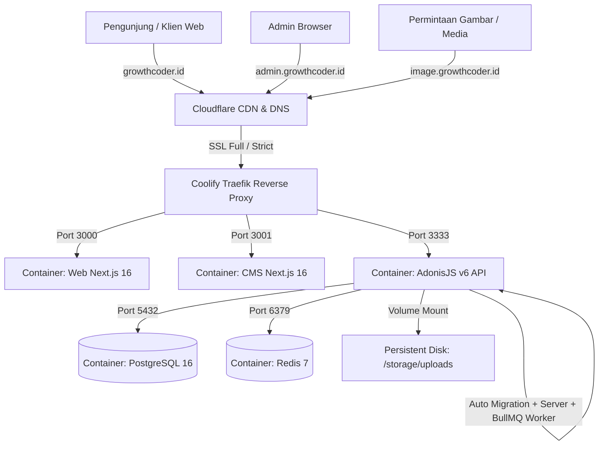

# 🚀 Panduan Lengkap Deployment Monorepo Menggunakan Coolify & Cloudflare DNS

Panduan ini berisi langkah-langkah praktis dan terperinci untuk melakukan deployment aplikasi **GrowthCoder Monorepo** (Next.js Web, Next.js CMS, AdonisJS v6 API, PostgreSQL, dan Redis) menggunakan **Coolify** di VPS Ubuntu, terintegrasi dengan **Cloudflare DNS & SSL**.

---

## 📑 Daftar Isi

1. [Arsitektur & Skema Domain](#1-arsitektur--skema-domain)
2. [Persiapan VPS & Instalasi Coolify](#2-persiapan-vps--instalasi-coolify)
3. [Konfigurasi Cloudflare DNS & SSL](#3-konfigurasi-cloudflare-dns--ssl)
4. [Membuat Database PostgreSQL & Redis di Coolify](#4-membuat-database-postgresql--redis-di-coolify)
5. [Deploy Backend API (`apps/api`)](#5-deploy-backend-api-appsapi)
6. [Deploy Frontend Web (`apps/web`)](#6-deploy-frontend-web-appsweb)
7. [Deploy Admin CMS (`apps/cms`)](#7-deploy-admin-cms-appscms)
8. [Verifikasi CI/CD & Auto Deploy](#8-verifikasi-cicd--auto-deploy)
9. [Panduan Migrasi Masa Depan ke Cloudflare R2](#9-panduan-migrasi-masa-depan-ke-cloudflare-r2)

---

## 1. Arsitektur & Skema Domain

Seluruh service berjalan terisolasi di dalam container Docker yang dikelola secara otomatis oleh Coolify:



| Service           | Subdomain / URL                                         | Port Container | Keterangan                          |
| :---------------- | :------------------------------------------------------ | :------------- | :---------------------------------- |
| **Web Portfolio** | `https://growthcoder.id` & `https://www.growthcoder.id` | `3000`         | Next.js 16 (App Router + SSR/ISR)   |
| **Admin CMS**     | `https://admin.growthcoder.id`                          | `3001`         | Next.js 16 (Passkeys WebAuthn)      |
| **REST API**      | `https://api.growthcoder.id`                            | `3333`         | AdonisJS v6 + SSE Transmit          |
| **Media / Asset** | `https://image.growthcoder.id`                          | `3333`         | Routed ke folder static uploads API |
| **PostgreSQL**    | `postgres:5432` _(Internal Network)_                    | `5432`         | Database Utama                      |
| **Redis**         | `redis:6379` _(Internal Network)_                       | `6379`         | Cache & BullMQ Queue Worker         |

---

## 2. Persiapan VPS & Instalasi Coolify

### Spesifikasi Minimum VPS yang Disarankan:

- **OS:** Ubuntu 22.04 LTS / 24.04 LTS (Fresh install).
- **CPU:** 2 vCPU Core.
- **RAM:** 4 GB RAM (Sangat disarankan 4GB agar proses build Next.js dan AdonisJS monorepo berjalan cepat tanpa error _Out of Memory_).
- **Storage:** 30 GB+ SSD / NVMe.

### Langkah Instalasi Coolify:

1. Login ke server VPS Anda via SSH terminal:
   ```bash
   ssh root@<IP_VPS_ANDA>
   ```
2. Pastikan paket OS telah diperbarui:
   ```bash
   apt update && apt upgrade -y && apt install curl -y
   ```
3. Jalankan perintah instalasi otomatis Coolify resmi:
   ```bash
   curl -fsSL https://cdn.coollabs.io/coolify/install.sh | bash
   ```
4. Setelah instalasi selesai (sekitar 2–3 menit), buka browser dan akses dashboard Coolify Anda di:
   $$\textbf{\texttt{http://<IP\_VPS\_ANDA>:8000}}$$
5. Buat akun Administrator pertama Anda di layar registrasi awal.

---

## 3. Konfigurasi Cloudflare DNS & SSL

Buka dashboard **Cloudflare** untuk domain `growthcoder.id`:

### A. Tambahkan DNS Records (A Record)

Tambahkan record berikut mengarah ke IP publik VPS Anda (Pastikan icon awan / Proxy **Aktif / Orange Cloud**):

| Type | Name                        | IPv4 Address    | Proxy Status     |
| :--- | :-------------------------- | :-------------- | :--------------- |
| `A`  | `@` (atau `growthcoder.id`) | `<IP_VPS_ANDA>` | Proxied (Orange) |
| `A`  | `www`                       | `<IP_VPS_ANDA>` | Proxied (Orange) |
| `A`  | `admin`                     | `<IP_VPS_ANDA>` | Proxied (Orange) |
| `A`  | `api`                       | `<IP_VPS_ANDA>` | Proxied (Orange) |
| `A`  | `image`                     | `<IP_VPS_ANDA>` | Proxied (Orange) |

### B. Konfigurasi SSL/TLS & WebSockets di Cloudflare

1. Buka menu **SSL/TLS** -> **Overview**:
   - Pilih mode enkripsi: **Full** atau **Full (Strict)**.
2. Buka menu **Network**:
   - Pastikan **WebSockets** dalam status **ON** (Diperlukan untuk AdonisJS Transmit SSE & real-time updates).
3. _(Opsional - Disarankan)_ Buka menu **SSL/TLS** -> **Edge Certificates**:
   - Aktifkan **Always Use HTTPS**: `ON`.
   - Aktifkan **Automatic HTTPS Rewrites**: `ON`.

---

## 4. Membuat Database PostgreSQL & Redis di Coolify

Sebelum men-deploy aplikasi, kita buat terlebih dahulu database dan cache di Coolify UI:

### A. Membuat PostgreSQL 16

1. Di Dashboard Coolify, masuk ke menu **Projects** -> Pilih Environment **Production** -> Klik **+ New Resource**.
2. Pilih **PostgreSQL**.
3. Isi konfigurasi:
   - **Database Name:** `growthcoder_db`
   - **User:** `growthcoder_user`
   - **Password:** _(Generate kata sandi yang aman atau biarkan dibuat otomatis oleh Coolify)_
4. Klik **Save** lalu klik **Start**.
5. Catat **Internal Connection String** atau detail koneksinya (misal: Host internal `postgres` / `postgresql-<id>`, user, password, dan nama database).

### B. Membuat Redis 7

1. Klik **+ New Resource** -> Pilih **Redis**.
2. Beri nama: `growthcoder-redis`.
3. Set password redis (atau biarkan default yang digenerate Coolify).
4. Klik **Save** lalu klik **Start**.
5. Catat host internal dan password redis tersebut.

---

## 5. Deploy Backend API (`apps/api`)

Backend API akan memproses migrasi database otomatis, menjalankan background queue worker (BullMQ), serta melayani endpoint API dan file media.

1. Di Dashboard Coolify, klik **+ New Resource** -> **Private / Public Repository (GitHub)**.
2. Pilih repository `growthcoder-portfolio-v2`, branch `main`.
3. Di pengaturan aplikasi:
   - **Build Pack:** `Dockerfile`
   - **Base Directory:** `/` _(Penting: Biarkan `/` agar context pnpm workspace terbaca)_
   - **Dockerfile Location:** `apps/api/Dockerfile`
   - **Domains:**
     ```text
     https://api.growthcoder.id, https://image.growthcoder.id
     ```
   - **Exposed Port:** `3333`
4. **Persistent Storage (Volume Uploads):**
   - Buka tab **Storages** / **Persistent Storage**.
   - Tambahkan storage volume:
     - **Name:** `api-uploads`
     - **Destination Path:** `/app/storage/uploads`
   - _(Hal ini memastikan semua gambar/file yang di-upload tidak hilang saat redeploy container)._
5. **Environment Variables:**
   Buka tab **Environment Variables** dan tambahkan nilai-nilai berikut:

   ```env
   # Node & Runtime
   NODE_ENV=production
   PORT=3333
   HOST=0.0.0.0
   LOG_LEVEL=info

   # App Secrets
   APP_KEY=isi_dengan_random_32_karakter_string_rahasia
   APP_URL=https://api.growthcoder.id

   # Session
   SESSION_DRIVER=cookie

   # Database Connection (Gunakan Host Internal dari PostgreSQL Coolify)
   DB_CONNECTION=pg
   DB_HOST=postgresql-growthcoder
   DB_PORT=5442
   DB_USER=growthcoder_user
   DB_PASSWORD=password_db_anda
   DB_DATABASE=growthcoder_db

   # Redis & Queue Worker (Gunakan Host Internal dari Redis Coolify)
   REDIS_HOST=redis-growthcoder
   REDIS_PORT=6379
   REDIS_PASSWORD=password_redis_anda
   REDIS_DB=0

   # Storage Driver
   DRIVE_DISK=local

   # Telegram Notifications (Opsional)
   TELEGRAM_BOT_TOKEN=
   TELEGRAM_CHAT_ID=
   ```

6. Klik **Save** -> Klik **Deploy**.

> [!TIP]
> **Generate APP_KEY:** Anda bisa membuat string random 32 karakter untuk `APP_KEY` dengan menjalankan perintah `openssl rand -base64 32` di terminal.

---

## 6. Deploy Frontend Web (`apps/web`)

1. Di Dashboard Coolify, klik **+ New Resource** -> **GitHub Repository**.
2. Pilih repository `growthcoder-portfolio-v2`, branch `main`.
3. Pengaturan aplikasi:
   - **Build Pack:** `Dockerfile`
   - **Base Directory:** `/`
   - **Dockerfile Location:** `apps/web/Dockerfile`
   - **Domains:**
     ```text
     https://growthcoder.id, https://www.growthcoder.id
     ```
   - **Exposed Port:** `3000`
4. **Environment Variables:**
   ```env
   NODE_ENV=production
   PORT=3000
   NEXT_PUBLIC_SITE_URL=https://growthcoder.id
   NEXT_PUBLIC_API_URL=https://api.growthcoder.id
   NEXT_PUBLIC_MEDIA_URL=https://image.growthcoder.id
   NEXT_PUBLIC_GA_MEASUREMENT_ID=G-XXXXXXXXXX
   ```
5. Klik **Save** -> Klik **Deploy**.

---

## 7. Deploy Admin CMS (`apps/cms`)

1. Di Dashboard Coolify, klik **+ New Resource** -> **GitHub Repository**.
2. Pilih repository `growthcoder-portfolio-v2`, branch `main`.
3. Pengaturan aplikasi:
   - **Build Pack:** `Dockerfile`
   - **Base Directory:** `/`
   - **Dockerfile Location:** `apps/cms/Dockerfile`
   - **Domains:**
     ```text
     https://admin.growthcoder.id
     ```
   - **Exposed Port:** `3001`
4. **Environment Variables:**
   ```env
   NODE_ENV=production
   PORT=3001
   NEXT_PUBLIC_API_URL=https://api.growthcoder.id
   NEXT_PUBLIC_MEDIA_URL=https://image.growthcoder.id
   ```
5. Klik **Save** -> Klik **Deploy**.

---

## 8. Verifikasi CI/CD & Auto Deploy

### A. Verifikasi Status Aplikasi

1. Buka `https://growthcoder.id` di browser -> Pastikan halaman utama terbuka sempurna dan animasi berjalan mulus.
2. Buka `https://admin.growthcoder.id` -> Lakukan login admin pertama dan coba upload file/gambar di menu artikel atau proyek.
3. Klik kanan pada gambar yang baru di-upload dan pilih _"Copy Image Address"_ -> Pastikan domain gambar berawalan:
   $$\textbf{\texttt{https://image.growthcoder.id/uploads/...}}$$

### B. Menguji Alur Auto Deploy (CI/CD)

1. Di Coolify, pada setiap aplikasi (Web, CMS, API), pastikan opsi **Auto Deploy on Git Push** dalam keadaan aktif (Centang _"Enable automatic deployments"_).
2. Lakukan perubahan kecil pada kode di komputer lokal Anda, misalnya update teks di `apps/web`.
3. Commit dan push ke GitHub:
   ```bash
   git add .
   git commit -m "feat: test auto deploy ci/cd via coolify"
   git push origin main
   ```
4. Buka dashboard Coolify -> Anda akan melihat proses build otomatis berjalan di background dan melakukan update versi secara _zero-downtime_.

---

## 9. Panduan Migrasi Masa Depan ke Cloudflare R2

Jika di kemudian hari ukuran media/gambar bertambah besar dan Anda ingin memindahkannya ke Cloudflare R2 (Object Storage):

### Langkah 1: Buat Bucket di Cloudflare R2

1. Masuk ke Cloudflare Dashboard -> **R2 Object Storage** -> **Create Bucket** (misal: `growthcoder-media`).
2. Masuk ke **Settings** bucket -> **Public Access** -> **Custom Domains** -> Hubungkan domain `image.growthcoder.id`.

### Langkah 2: Buat API Token R2

1. Di Cloudflare R2, buka **Manage R2 API Tokens** -> **Create API Token** (dengan hak akses _Object Read & Write_).
2. Dapatkan:
   - `AWS_ACCESS_KEY_ID`
   - `AWS_SECRET_ACCESS_KEY`
   - `AWS_ENDPOINT` (`https://<ACCOUNT_ID>.r2.cloudflarestorage.com`)
   - `AWS_BUCKET` (`growthcoder-media`)

### Langkah 3: Update Environment Variables di API Coolify

Ubah env di aplikasi `apps/api`:

```env
DRIVE_DISK=s3
AWS_ACCESS_KEY_ID=token_access_key_anda
AWS_SECRET_ACCESS_KEY=token_secret_key_anda
AWS_ENDPOINT=https://<ACCOUNT_ID>.r2.cloudflarestorage.com
AWS_BUCKET=growthcoder-media
AWS_REGION=auto
```

Klik **Save & Redeploy**.

> [!NOTE]
> Karena frontend Web dan CMS sudah menggunakan helper `resolveMediaUrl()` dengan `NEXT_PUBLIC_MEDIA_URL=https://image.growthcoder.id`, **tidak ada kode frontend yang perlu diubah!** Semua gambar akan otomatis tersimpan dan terlayani langsung via Cloudflare R2 CDN.
